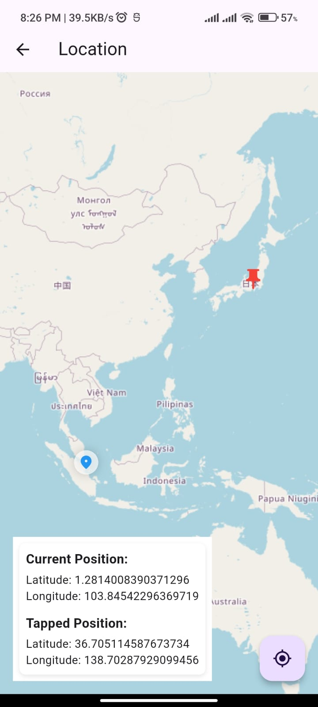

# Flutter Geo OSM

Welcome to Flutter Geo OSM! This project is a Flutter application utilizing OpenStreetMap (OSM) for geolocation and mapping functionalities.



## Features

- **Geolocation**: Get the user's current location using the device's GPS.
- **Map Display**: Display a map with markers, polygons, and other overlays using OSM data.

## Prerequisites

Before running this project, ensure you have:

- Flutter SDK 3.2 or higher
- Dart 3.5.2 or higher
- OSM Plugins (e.g., `flutter_map` or `osm_flutter`)

## Getting Started

To get started with Flutter Geo OSM, follow these steps:

1. Clone the repository:
   ```bash
   git clone https://github.com/your-username/flutter-geo-osm.git
   ```
2. Navigate to the project directory:
   ```bash
   cd flutter-geo-osm
   ```
3. Install dependencies:
   ```bash
   flutter pub get
   ```
4. Run the app:
   ```bash
   flutter run
   ```

## Usage

Once the app is running, you can:

- View the current location by tapping on the "Locate Me" button.
- Add marker for know Latlon

## Contributing

Contributions are welcome! If you have any ideas, bug reports, or feature requests, feel free to open an issue or submit a pull request.

## License

This project is licensed under the [MIT License](LICENSE).

---

These updates should make the README more comprehensive and helpful for potential users and contributors.
